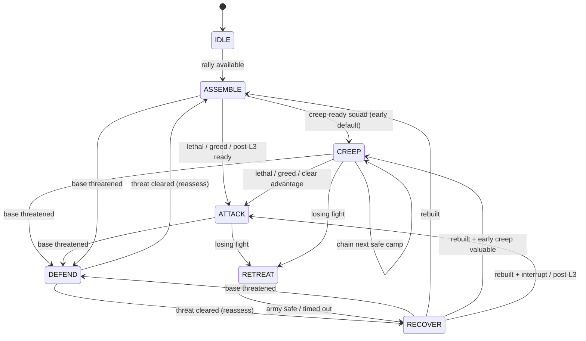

# Military AI V2

**Status:** Default production controller (`MilitaryAIConfig.USE_MILITARY_AI_V2 = true`)  
**Stack:** `MilitaryDirectorV2` (strategy) → `ArmyMissionV2` / `ArmySquadV2` (payload) → `ArmyCommanderV2` (execution)

Military AI V2 is the sole owner of main-army strategic decisions and order issuance. Legacy economy, worker, build, production, resource, tech, and placement AI remain unchanged.

---

## Feature toggle

| Constant | Default | Meaning |
|----------|---------|---------|
| `MilitaryAIConfig.USE_MILITARY_AI_V2` | `true` | Production path — V2 owns military |

**Developer-only legacy switch:** set `USE_MILITARY_AI_V2 = false` in `scripts/systems/military_ai_config.gd` to restore the pre-V2 military controllers for comparison. Do not leave both stacks issuing main-army orders concurrently — the gate is mutual exclusion, not dual-run.

Helpers:

- `MilitaryAIConfig.is_v2_enabled()`
- `MilitaryAIConfig.ai_version_label()` → `"V2"` or `"Legacy"`

---

## Ownership rules

| Concern | Owner | Notes |
|---------|-------|-------|
| Strategic state machine | `MilitaryDirectorV2` | Exactly one active state |
| Mission payload | `MilitaryDirectorV2` publishes `ArmyMissionV2` | Commander never invents missions |
| Main squad membership | `MilitaryDirectorV2` / `ArmySquadV2` | Commander reads; does not recruit |
| Unit order issuance | `ArmyCommanderV2` | Attack-move, retreat, assemble slots |
| Shared order-bus drain | `ArmyCommanderV2` via `EnemyArmyCommand` | Queue owned by match `AIPlayerState.pending_group_orders` |
| Reinforcement waiting registry | `AIPlayerState.reinforcement_pool` | Sole match owner; EAC accessors only |
| Creep contest cooldowns | `AIPlayerState.creep_contest_cooldowns` | Match-durable; blocks camp contest only |
| Attack-objective timers | `AIPlayerState.objective_*` | Mission/wave-owned; cleared on objective cancel + reset |
| TTL threat caches | `AIPlayerState` (scratch) | Recomputed from world; never authoritative SoT |
| Mission watchdog / exec scratch | `AIPlayerState` | Cleared with mission + match reset |
| Frame-local army unit caches | `EnemyArmyCommand` static | Keyed by `Engine` frame; cleared on reset; never SoT |
| Order-issue / perf telemetry | `EnemyArmyCommandTelemetry` | F3 / diagnostics only; never mission or order authority |
| Hero kit micro | `AIHeroMastery` via `ArmyCommanderV2` | Abilities / local targets only |
| Economy / workers / build / train / tech / placement | Legacy managers | Unchanged under V2 |
| Low-level army helpers | `EnemyArmyCommand`, creep helpers, etc. | Reused; not independent mission owners |

### Authority split

```
MilitaryDirectorV2          chooses IDLE / ASSEMBLE / CREEP / ATTACK / DEFEND / RETREAT / RECOVER
        │ publishes
        ▼
ArmyMissionV2 + ArmySquadV2  immutable-ish payload + roster
        │
        ▼
ArmyCommanderV2              issues formation orders + hero micro tick
        │
        ▼
EnemyArmyCommand             shared order bus / unit APIs
```

---

## State transitions

Director priority each strategic tick (high → low):

1. **DEFEND** — base / worker threat always preempts CREEP / ATTACK / ASSEMBLE / RECOVER
2. **RETREAT** — finish an in-progress withdrawal before other offense
3. Emergency **RETREAT** from a losing ATTACK / CREEP fight
4. **RECOVER** — rebuild near base; hard max duration prevents stalls
5. **ATTACK vs CREEP** — early openings prefer CREEP (≈ hero level 3 / 2–3 camps). ATTACK preempts CREEP only on lethal / high greed / clear strength advantage, never merely because the minimum attack squad exists.
6. **ASSEMBLE** — default gather at safe rally



Key invariants:

- After DEFEND clears, the director **reassesses** — it never resumes a stale creep/attack reservation automatically.
- Voluntary exits respect `V2_STATE_COMMIT_SECONDS`; emergencies (DEFEND / RETREAT) may bypass.
- Post-retreat ATTACK re-entry is blocked by `V2_POST_RETREAT_ATTACK_COOLDOWN_SECONDS`.
- Mission watchdog cancels stalled CREEP / ATTACK / DEFEND / RETREAT after ~6–8s without progress, refreshes orders once, then falls back safely.
- F3 status is owned by `MilitaryDirectorV2` while V2 is active (no false Legacy mission labels).

---

## Economy boundary

**Active under V2 (do not gate):**

- `EnemyBuildManager` — structures, production queues, research, shop
- `EnemyGatherManager` — worker gold/wood assignment
- `EnemyResourceManager` — spend gates
- `TechTree` / `UpgradeManager`
- `EnemyBuildPlacement` — placement geometry
- Building spawn hooks that register combat units and send them toward rally / pending admission

**Not economy:** anything that chooses creep / attack / defend / retreat / regroup for the main army belongs to V2.

---

## Hero AI boundary

`AIHeroMastery` (ticked by `ArmyCommanderV2`):

| MAY | MAY NOT |
|-----|---------|
| Cast abilities | Choose the army mission |
| Pick local combat targets during the current mission | Start creeping |
| Survival / kite / follow-army micro | Launch attacks |
| | Order regrouping |
| | Override DEFEND / RETREAT owned by the director |

Hero strategic participation is “fight with the squad on the published mission,” never “become a second mission owner.”

---

## Prohibited competing mission owners

When `USE_MILITARY_AI_V2` is `true`, these legacy subsystems **must not** issue main-army military orders. Each runs as an **intent provider** (publishes `MilitaryIntent` onto match-owned `AIPlayerState`) and early-returns from order-issuing paths:

| Legacy subsystem | Role under V2 | Gate location |
|------------------|---------------|---------------|
| `EnemyCreepManager` | Publishes `CREEP` / `SUSPEND_CREEP` intents | `_process` → `_publish_creep_intents` |
| `EnemyWaveManager` | Publishes `ATTACK` / `FINISH` intents | `_process` → `_publish_offense_intents` |
| `EnemyDefenseManager` | Publishes `DEFEND` intents | `_process` → `_publish_defense_intents` |
| `EnemyCombatController` | Legacy regroup + retreat + combat mission owner (still gated off) | `_process` |
| `EnemyStrategicDirector._set_main_mission` | Competing main-army mission owner | method gate |
| `EnemyStrategicDirector._run_recovery_checks` | Legacy recovery / idle-army owner | method gate |

`MilitaryDirectorV2` drains the intent bus once per strategic tick, prefers provider `DEFEND` payloads when present, and uses offense/creep intents as arbitration hints. Fallback evaluators remain if the bus is empty.

**Preserved for V2 reuse (not deleted):**

- Camp queries / regroup helpers on `EnemyCreepManager`
- Strength, formation, order-bus, and scoring helpers on `EnemyArmyCommand`
- Lethal / greed score math on `EnemyAggression` (scored by V2; not an independent order issuer under V2)
- Spawn → rally / `assign_reinforcement_regroup` unit routing into the director’s pending pool

---

## Extension rules for future features

**Critical rule:** Any new military feature must integrate through `MilitaryDirectorV2` or `ArmyCommanderV2`. It must **not** create another independent main-army mission owner.

Checklist for new work:

1. **Strategy change?** Add a director evaluation / transition. Publish a new or updated `ArmyMissionV2`. Do not call `EnemyArmyCommand.command_*` from a new manager’s `_process`.
2. **Tactical / formation change?** Implement inside `ArmyCommanderV2` (or a helper it calls), reading the current mission + squad only.
3. **Shared math?** Prefer `EnemyArmyCommand` / existing helpers; keep them order-agnostic.
4. **Hero kit change?** Stay inside `AIHeroMastery` boundaries above.
5. **Economy / production change?** Use the legacy economy managers — out of V2 scope.
6. **Never** add a parallel timer that issues attack-move / regroup / retreat to `enemy_combat_units` while V2 is enabled.
7. If a temporary experiment needs legacy behavior, flip `USE_MILITARY_AI_V2` to `false` — do not dual-enable.

---

## Scene wiring

`scenes/match/match_systems.tscn` is a `MatchCompositionRoot`:

- Owns match-scoped `AIPlayerState` (army / strategic / exec / combat mirrors from `EnemyArmyCommand` + creep-contest / objective timers + `MilitaryIntent` bus)
- Declares the sole military command authority (`ArmyCommanderV2` when V2 is enabled)
- Resolves director / commander / legacy managers for sibling lookup

### EnemyArmyCommand state ownership (post telemetry extraction)

Authoritative military runtime lives on match-owned `AIPlayerState` (accessed via `EnemyArmyCommand._rt()`). Remaining EAC class statics are only:

| Bag | Role |
|-----|------|
| Frame-local unit caches | Discovery scratch keyed by `Engine` frame |
| `_bound_player_state` / `_declared_command_authority` / `_unbound_runtime` | Composition binding |

**Extracted (2026-08-05):** `EnemyArmyCommandTelemetry` owns debug-override, perf/overlay cadence timers, orders-issued counter, and last-issued order labels. It does not select missions or enqueue orders. Not an autoload.

`EnemyArmyCommand` remains the shared order-bus / army-helper facade. Further scoped extractions (pure math/scoring) are allowed; do not begin a broad god-object split until a narrow seam is chosen.

Child systems still include:

- `MilitaryDirectorV2`
- `ArmyCommanderV2`

alongside legacy military nodes (intent providers under V2 + legacy switch) and the always-on economy managers.

---

## Verification

Headless:

```text
Godot_v4.7-stable_win64.exe --headless --path <project> res://scenes/debug/verify_military_ai_v2.tscn
```

### Mission execution integrity (critical)

V2 missions must always produce executable squad orders:

1. `MilitaryDirectorV2` publishes the mission and syncs legacy strategic/army-mode authority on transition.
2. `ArmyCommanderV2` re-syncs authority every frame, then issues Attack-Move for CREEP / ATTACK / DEFEND travel (retreats use retreat orders).
3. If `issue_group_combat_move` fails, the commander force-issues Attack-Move — it must never clear the mission and leave the squad idle.
4. Idle guard: if a combat squad has no meaningful move/attack-move/fight order for `V2_SQUAD_IDLE_SECONDS` (2s), regenerate a valid order immediately.
5. F3 shows Mission, Destination, Order, Last Order, Last Mission Change, and Idle Time so desync is visible.

Legacy `allows_creep_orders()` / army-mode soft-locks must not block V2 CREEP after ATTACK — `prepare_v2_execution()` clears that gate.

Manual long-match checklist:

- Opening: economy, hero train, unit train, army assembles
- Creeping: real camps cleared, hero XP, gold awarded
- Defense: base attack → immediate DEFEND response
- Attack: coherent push to player base, no idle stall
- Retreat / recovery: losing army retreats, rebuilds, returns
- Long match: multiple strategic cycles; no mission freeze, false F3, single-unit trickle, duplicate-order spam, repath explosion, or freed-object errors